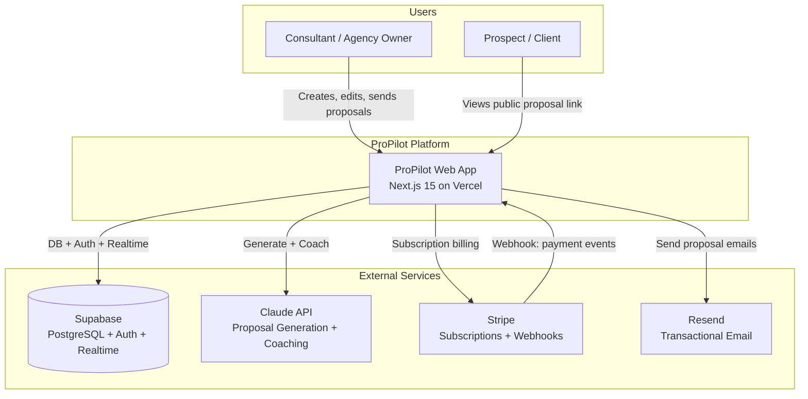
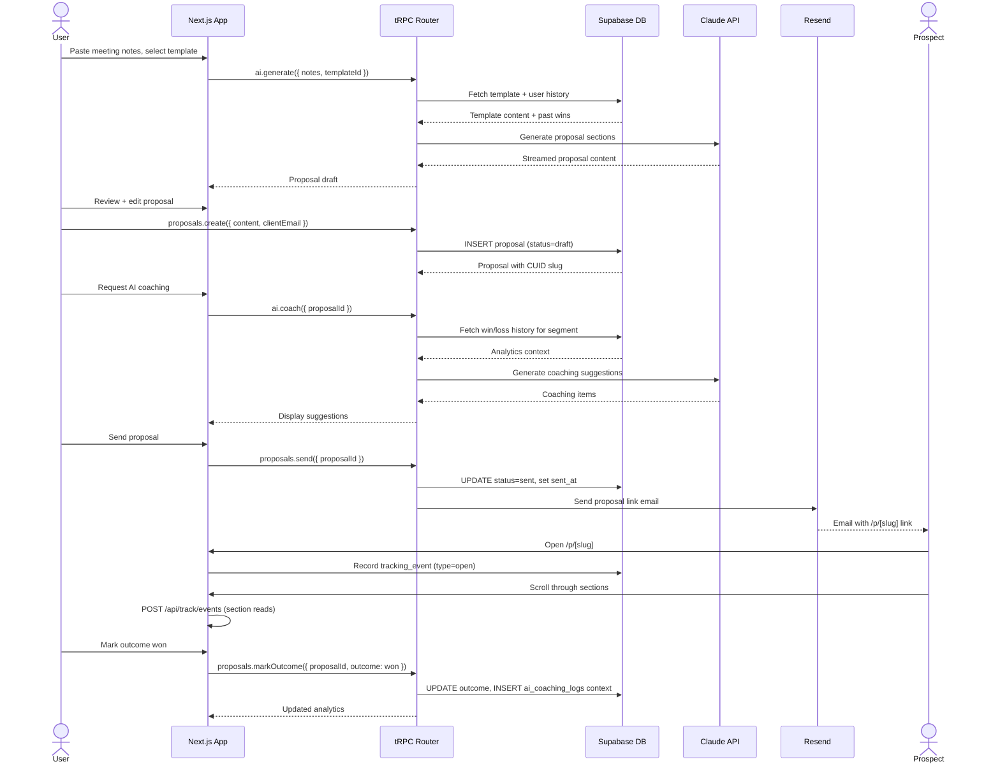
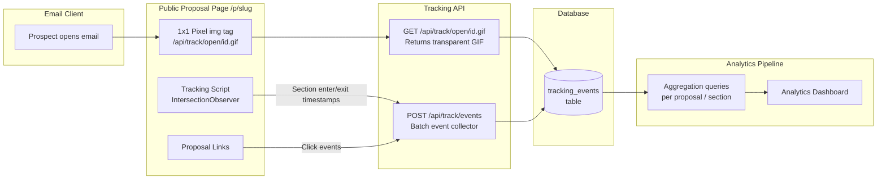
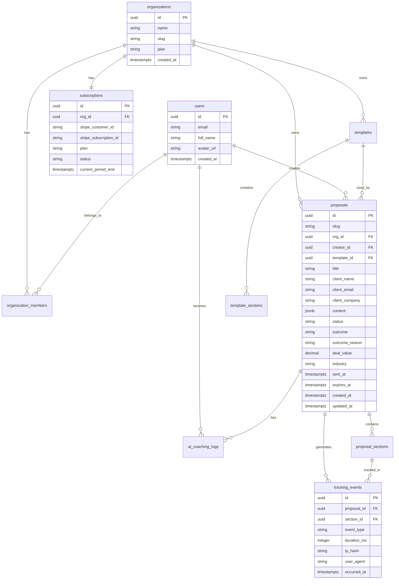
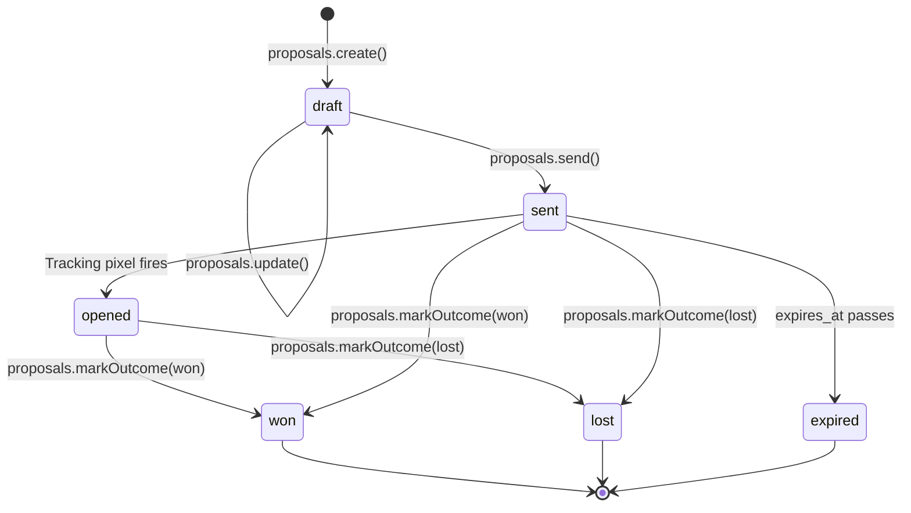

# ProPilot — Design Document

**Version:** 1.0
**Date:** 2026-03-23
**Author:** Architecture Planner
**Status:** Draft — Pending Sprint Planning

---

## Table of Contents

1. [Introduction](#1-introduction)
2. [System Architecture Diagrams](#2-system-architecture-diagrams)
3. [Data Structures](#3-data-structures)
4. [API Contracts](#4-api-contracts)
5. [Frontend Architecture](#5-frontend-architecture)
6. [Conventions & Patterns](#6-conventions--patterns)
7. [Security Model](#7-security-model)
8. [Error Handling Matrix](#8-error-handling-matrix)
9. [Test Strategy](#9-test-strategy)
10. [Development Milestones](#10-development-milestones)
11. [Project Setup & Tooling](#11-project-setup--tooling)

---

## 1. Introduction

### 1.1 Purpose

This document provides the implementation-ready technical specification for ProPilot — an AI proposal intelligence platform. It is intended for the engineering team moving from planning to sprint execution. It covers the full system: database schema, API contracts, frontend component hierarchy, security model, and a 5-milestone delivery plan with definitions of done.

### 1.2 Problem Statement

Independent consultants and small agencies (1–15 people) send 10–50 proposals per month with a 30–40% win rate and have zero data on WHY they win or lose. Enterprise tools that solve this (Gong, Seismic) are priced for large sales teams. Affordable tools (Proposify, PandaDoc, Better Proposals) are template editors with no intelligence layer. No tool under $500/month offers closed-loop proposal analytics.

### 1.3 Solution Overview

ProPilot is the intelligence layer on top of proposal workflows. Users draft proposals (aided by Claude AI), send them as tracked links, capture open/read/click events at section granularity, mark outcomes (won/lost), and receive AI coaching that draws on historical win data before each new send. Every sent proposal carries a viral "Powered by ProPilot" footer driving organic acquisition.

### 1.4 Scope

**In scope (V1):**
- AI proposal generation from meeting notes + templates
- Rich text editor with section-based structure
- Reusable templates with variable substitution
- Pixel-based email tracking (open, section read time, link clicks)
- Outcome management (won/lost + client feedback)
- Stripe subscription integration with auto-win detection from payments
- Analytics dashboard (win rate trends, section heatmaps, pricing analysis)
- Pre-send AI coach drawing on historical win data
- Viral "Powered by ProPilot" footer (removable at Team tier)
- Public proposal view at `/p/[slug]`
- Three subscription tiers: Solo ($49), Team ($99), Agency ($199)

**Out of scope (V2+):**
- CRM integrations (Salesforce, HubSpot)
- E-signatures
- Multi-language support
- Mobile native app
- Custom domain for proposal links

### 1.5 Key Constraints

- **Privacy:** Tracking pixel must not expose PII in the URL or response headers
- **Latency:** AI generation requests must respond within 30 seconds (Claude API streaming)
- **Tenant isolation:** All data access gated via Supabase RLS — no cross-org data leakage possible
- **Stripe idempotency:** Webhook handlers must be idempotent; Stripe will retry on failure
- **Free tier limits:** Supabase free tier has 500MB storage and 2GB bandwidth — design for efficient tracking event storage
- **Public links:** Proposal slugs must be unguessable (CUID2 or UUID) and support expiration

---

## 2. System Architecture Diagrams

### 2.1 System Context (C4 Level 1)



### 2.2 Container Diagram (C4 Level 2)

```mermaid
graph TB
    subgraph Vercel Edge
        NX[Next.js App Router\nSSR + API Routes]
        TR[tRPC Routers\n/api/trpc]
        TK[Tracking Endpoints\n/api/track]
        AI[AI Endpoints\n/api/ai]
        WH[Stripe Webhook\n/api/webhooks/stripe]
        PV[Public Proposal View\n/p/[slug]]
    end

    subgraph Supabase Cloud
        PG[(PostgreSQL\nAll app data)]
        AU[Auth Service\nJWT + Sessions]
        RT[Realtime\nProposal status updates]
        ST2[Storage\nProposal assets]
    end

    subgraph AI Layer
        CL[Claude API\nclaude-3-5-sonnet]
    end

    subgraph Payment Layer
        STR[Stripe API\nSubscriptions]
    end

    subgraph Email Layer
        RSD[Resend API\nProposal delivery]
    end

    NX --> TR
    NX --> TK
    NX --> AI
    NX --> WH
    NX --> PV
    TR --> PG
    TR --> AU
    AI --> CL
    TK --> PG
    WH --> STR
    WH --> PG
    PV --> PG
    NX --> RSD
    NX --> RT
```

### 2.3 Proposal Lifecycle Sequence



### 2.4 Tracking Data Flow



### 2.5 Entity Relationship Diagram



### 2.6 Proposal Status State Diagram



---

## 3. Data Structures

### 3.1 users

**Purpose:** Represents authenticated individuals. Mirrors `auth.users` in Supabase Auth; this table stores app-level profile data.

**Table:** `public.users`

| Field | Type | Constraints | Default | Description |
|-------|------|-------------|---------|-------------|
| id | UUID | PK | `auth.uid()` | Matches Supabase Auth user ID |
| email | VARCHAR(255) | UNIQUE, NOT NULL | — | Auth email address |
| full_name | VARCHAR(100) | NOT NULL | — | Display name |
| avatar_url | TEXT | NULLABLE | NULL | Profile photo URL |
| created_at | TIMESTAMPTZ | NOT NULL | `NOW()` | Row creation timestamp |
| updated_at | TIMESTAMPTZ | NOT NULL | `NOW()` | Last update timestamp |

**Indexes:**
- `users_pkey` — PK on `id`
- `users_email_key` — UNIQUE on `email`

**RLS Policies:**
- `SELECT`: `auth.uid() = id` (users read their own row only)
- `UPDATE`: `auth.uid() = id`

---

### 3.2 organizations

**Purpose:** Multi-user workspace. Corresponds to a billing entity. Solo plan = 1 member.

**Table:** `public.organizations`

| Field | Type | Constraints | Default | Description |
|-------|------|-------------|---------|-------------|
| id | UUID | PK | `gen_random_uuid()` | Organization ID |
| name | VARCHAR(150) | NOT NULL | — | Organization display name |
| slug | VARCHAR(100) | UNIQUE, NOT NULL | — | URL-safe identifier |
| plan | ENUM('solo','team','agency') | NOT NULL | `'solo'` | Active subscription plan |
| white_label | BOOLEAN | NOT NULL | `FALSE` | Hide "Powered by ProPilot" footer |
| created_at | TIMESTAMPTZ | NOT NULL | `NOW()` | Creation timestamp |
| updated_at | TIMESTAMPTZ | NOT NULL | `NOW()` | Last update timestamp |

**Indexes:**
- `organizations_pkey` — PK on `id`
- `organizations_slug_key` — UNIQUE on `slug`

**Validation:**
- `slug`: lowercase alphanumeric + hyphens, 3–100 chars

---

### 3.3 organization_members

**Purpose:** Join table linking users to organizations with roles. Enables multi-user Team/Agency plans.

**Table:** `public.organization_members`

| Field | Type | Constraints | Default | Description |
|-------|------|-------------|---------|-------------|
| id | UUID | PK | `gen_random_uuid()` | Member record ID |
| org_id | UUID | FK → organizations.id, NOT NULL | — | Organization reference |
| user_id | UUID | FK → users.id, NOT NULL | — | User reference |
| role | ENUM('owner','admin','member') | NOT NULL | `'member'` | Permission level |
| invited_by | UUID | FK → users.id, NULLABLE | NULL | Who invited this member |
| joined_at | TIMESTAMPTZ | NOT NULL | `NOW()` | When user accepted invite |

**Indexes:**
- `org_members_org_user_key` — UNIQUE on `(org_id, user_id)`
- `idx_org_members_user_id` — on `user_id` (auth checks)

**RLS Policies:**
- `SELECT`: user must be a member of the organization

---

### 3.4 subscriptions

**Purpose:** Tracks Stripe subscription state. Source of truth for plan gating. Kept in sync via Stripe webhook.

**Table:** `public.subscriptions`

| Field | Type | Constraints | Default | Description |
|-------|------|-------------|---------|-------------|
| id | UUID | PK | `gen_random_uuid()` | Subscription record ID |
| org_id | UUID | FK → organizations.id, UNIQUE, NOT NULL | — | One subscription per org |
| stripe_customer_id | VARCHAR(255) | UNIQUE, NOT NULL | — | Stripe customer ID (`cus_xxx`) |
| stripe_subscription_id | VARCHAR(255) | UNIQUE, NULLABLE | NULL | Stripe subscription ID (`sub_xxx`) |
| plan | ENUM('solo','team','agency') | NOT NULL | `'solo'` | Active plan |
| status | ENUM('active','past_due','canceled','trialing','incomplete') | NOT NULL | `'active'` | Stripe subscription status |
| current_period_end | TIMESTAMPTZ | NULLABLE | NULL | When current billing period ends |
| cancel_at_period_end | BOOLEAN | NOT NULL | `FALSE` | Scheduled for cancellation |
| created_at | TIMESTAMPTZ | NOT NULL | `NOW()` | Created timestamp |
| updated_at | TIMESTAMPTZ | NOT NULL | `NOW()` | Last Stripe sync timestamp |

**Indexes:**
- `subscriptions_stripe_customer_id_key` — UNIQUE on `stripe_customer_id`
- `subscriptions_org_id_key` — UNIQUE on `org_id`

---

### 3.5 templates

**Purpose:** Reusable proposal structure. Can be created by a user or provided as system defaults.

**Table:** `public.templates`

| Field | Type | Constraints | Default | Description |
|-------|------|-------------|---------|-------------|
| id | UUID | PK | `gen_random_uuid()` | Template ID |
| org_id | UUID | FK → organizations.id, NULLABLE | NULL | NULL = system-default template |
| name | VARCHAR(150) | NOT NULL | — | Template display name |
| description | TEXT | NULLABLE | NULL | What this template is for |
| industry | VARCHAR(100) | NULLABLE | NULL | Target industry tag |
| is_system | BOOLEAN | NOT NULL | `FALSE` | True = shipped with ProPilot |
| created_by | UUID | FK → users.id, NULLABLE | NULL | NULL for system templates |
| created_at | TIMESTAMPTZ | NOT NULL | `NOW()` | Creation timestamp |
| updated_at | TIMESTAMPTZ | NOT NULL | `NOW()` | Last update timestamp |

**Indexes:**
- `idx_templates_org_id` — on `org_id`
- `idx_templates_is_system` — partial index on `is_system = TRUE`

---

### 3.6 template_sections

**Purpose:** Ordered sections within a template. Each section has a name, optional prompt hint for AI generation, and placeholder variable definitions.

**Table:** `public.template_sections`

| Field | Type | Constraints | Default | Description |
|-------|------|-------------|---------|-------------|
| id | UUID | PK | `gen_random_uuid()` | Section ID |
| template_id | UUID | FK → templates.id, NOT NULL | — | Parent template |
| name | VARCHAR(150) | NOT NULL | — | Section display name (e.g. "About Us") |
| order_index | SMALLINT | NOT NULL | — | Rendering order (0-based) |
| ai_prompt | TEXT | NULLABLE | NULL | Hint for AI when generating this section |
| default_content | TEXT | NULLABLE | NULL | Fallback static content |
| variables | JSONB | NOT NULL | `'[]'` | Array of variable names expected in this section |

**Indexes:**
- `idx_template_sections_template_id` — on `template_id`

**Validation:**
- `variables`: JSON array of strings, max 20 items
- `order_index`: 0–99

---

### 3.7 proposals

**Purpose:** A single proposal document sent to a prospect. Contains full content snapshot at send time plus tracking metadata.

**Table:** `public.proposals`

| Field | Type | Constraints | Default | Description |
|-------|------|-------------|---------|-------------|
| id | UUID | PK | `gen_random_uuid()` | Proposal ID |
| slug | VARCHAR(30) | UNIQUE, NOT NULL | — | Public URL token (CUID2) |
| org_id | UUID | FK → organizations.id, NOT NULL | — | Owning organization |
| creator_id | UUID | FK → users.id, NOT NULL | — | User who created this |
| template_id | UUID | FK → templates.id, NULLABLE | NULL | Source template (nullable if deleted) |
| title | VARCHAR(255) | NOT NULL | — | Internal proposal title |
| client_name | VARCHAR(150) | NOT NULL | — | Prospect display name |
| client_email | VARCHAR(255) | NOT NULL | — | Prospect email address |
| client_company | VARCHAR(150) | NULLABLE | NULL | Prospect company name |
| deal_value | NUMERIC(12,2) | NULLABLE | NULL | Estimated deal value in USD |
| industry | VARCHAR(100) | NULLABLE | NULL | Deal industry for segmentation |
| status | ENUM('draft','sent','opened','won','lost','expired') | NOT NULL | `'draft'` | Lifecycle status |
| outcome | ENUM('won','lost') | NULLABLE | NULL | Final outcome (set when marked) |
| outcome_reason | TEXT | NULLABLE | NULL | Optional client feedback on outcome |
| stripe_payment_id | VARCHAR(255) | NULLABLE | NULL | Stripe payment that auto-confirmed win |
| content | JSONB | NOT NULL | `'{}'` | Full proposal content snapshot |
| sent_at | TIMESTAMPTZ | NULLABLE | NULL | When proposal was sent |
| first_opened_at | TIMESTAMPTZ | NULLABLE | NULL | When prospect first viewed |
| expires_at | TIMESTAMPTZ | NULLABLE | NULL | Public link expiry (default 90 days) |
| created_at | TIMESTAMPTZ | NOT NULL | `NOW()` | Creation timestamp |
| updated_at | TIMESTAMPTZ | NOT NULL | `NOW()` | Last update timestamp |

**Indexes:**
- `proposals_slug_key` — UNIQUE on `slug` (public view lookups)
- `idx_proposals_org_id` — on `org_id`
- `idx_proposals_status` — on `(org_id, status)` (dashboard filtering)
- `idx_proposals_sent_at` — on `sent_at` (time-series analytics)
- `idx_proposals_outcome` — on `(org_id, outcome)` (win rate calculations)

**RLS Policies:**
- `SELECT/UPDATE/DELETE`: `org_id IN (SELECT org_id FROM organization_members WHERE user_id = auth.uid())`

**Content JSONB shape:**
```typescript
interface ProposalContent {
  sections: {
    id: string;
    templateSectionId: string | null;
    name: string;
    content: string; // rich text HTML
    order: number;
  }[];
  variables: Record<string, string>; // key=variable name, value=substituted value
  coverImage?: string;
  brandColor?: string;
  footer?: string;
}
```

---

### 3.8 proposal_sections

**Purpose:** Denormalized section index for per-section analytics without parsing the content JSONB. Updated whenever proposal content is saved.

**Table:** `public.proposal_sections`

| Field | Type | Constraints | Default | Description |
|-------|------|-------------|---------|-------------|
| id | UUID | PK | `gen_random_uuid()` | Section record ID |
| proposal_id | UUID | FK → proposals.id, NOT NULL | — | Parent proposal |
| name | VARCHAR(150) | NOT NULL | — | Section name (mirrors content) |
| order_index | SMALLINT | NOT NULL | — | Rendering order |
| word_count | SMALLINT | NOT NULL | `0` | Word count for context |

**Indexes:**
- `idx_proposal_sections_proposal_id` — on `proposal_id`

---

### 3.9 tracking_events

**Purpose:** Immutable append-only log of all prospect interaction events. High write volume — designed for time-series aggregation.

**Table:** `public.tracking_events`

| Field | Type | Constraints | Default | Description |
|-------|------|-------------|---------|-------------|
| id | UUID | PK | `gen_random_uuid()` | Event ID |
| proposal_id | UUID | FK → proposals.id, NOT NULL | — | Proposal being tracked |
| section_id | UUID | FK → proposal_sections.id, NULLABLE | NULL | NULL for open/click events |
| event_type | ENUM('open','section_enter','section_exit','link_click','download') | NOT NULL | — | Event classification |
| duration_ms | INTEGER | NULLABLE | NULL | Read duration for section events |
| link_url | TEXT | NULLABLE | NULL | Clicked URL (for link_click events) |
| ip_hash | CHAR(64) | NULLABLE | NULL | SHA-256 of IP (no raw PII) |
| user_agent_hash | CHAR(64) | NULLABLE | NULL | SHA-256 of user agent |
| occurred_at | TIMESTAMPTZ | NOT NULL | `NOW()` | Event timestamp |

**Indexes:**
- `idx_tracking_events_proposal_id` — on `proposal_id`
- `idx_tracking_events_occurred_at` — on `occurred_at` (time-range queries)
- `idx_tracking_events_type_proposal` — on `(proposal_id, event_type)`

**Notes:**
- No `updated_at` — events are immutable
- `ip_hash` and `user_agent_hash` are one-way hashed on ingestion — never store raw IP
- Consider Supabase Realtime subscription on this table for live "proposal viewed" notification to owner

**RLS Policies:**
- `INSERT`: public (no auth required — tracking pixel and frontend script)
- `SELECT`: `proposal_id IN (SELECT id FROM proposals WHERE org_id IN (SELECT org_id FROM organization_members WHERE user_id = auth.uid()))`

---

### 3.10 ai_coaching_logs

**Purpose:** Stores AI coaching suggestions generated before a proposal send. Preserved for model quality analysis and future fine-tuning signal.

**Table:** `public.ai_coaching_logs`

| Field | Type | Constraints | Default | Description |
|-------|------|-------------|---------|-------------|
| id | UUID | PK | `gen_random_uuid()` | Log ID |
| proposal_id | UUID | FK → proposals.id, NOT NULL | — | Proposal being coached |
| user_id | UUID | FK → users.id, NOT NULL | — | User who requested coaching |
| context_snapshot | JSONB | NOT NULL | — | Win/loss context fed to Claude |
| suggestions | JSONB | NOT NULL | — | Array of coaching suggestions returned |
| model | VARCHAR(100) | NOT NULL | — | Claude model version used |
| input_tokens | INTEGER | NULLABLE | NULL | Token usage for cost tracking |
| output_tokens | INTEGER | NULLABLE | NULL | Token usage for cost tracking |
| created_at | TIMESTAMPTZ | NOT NULL | `NOW()` | Timestamp of coaching request |

**Indexes:**
- `idx_ai_coaching_logs_proposal_id` — on `proposal_id`
- `idx_ai_coaching_logs_user_id` — on `user_id`

**Suggestions JSONB shape:**
```typescript
interface CoachingSuggestion {
  section: string;
  type: 'improve' | 'warning' | 'strength';
  message: string;
  evidence: string; // e.g. "Proposals with this pricing format win 67% of the time"
}
```

---

### 3.11 TypeScript Domain Types

```typescript
// src/types/domain.ts

export type ProposalStatus = 'draft' | 'sent' | 'opened' | 'won' | 'lost' | 'expired';
export type ProposalOutcome = 'won' | 'lost';
export type OrgPlan = 'solo' | 'team' | 'agency';
export type MemberRole = 'owner' | 'admin' | 'member';
export type TrackingEventType = 'open' | 'section_enter' | 'section_exit' | 'link_click' | 'download';
export type SubscriptionStatus = 'active' | 'past_due' | 'canceled' | 'trialing' | 'incomplete';

export interface ProposalSection {
  id: string;
  templateSectionId: string | null;
  name: string;
  content: string;
  order: number;
}

export interface ProposalContent {
  sections: ProposalSection[];
  variables: Record<string, string>;
  coverImage?: string;
  brandColor?: string;
  footer?: string;
}

export interface CoachingSuggestion {
  section: string;
  type: 'improve' | 'warning' | 'strength';
  message: string;
  evidence: string;
}
```

---

## 4. API Contracts

ProPilot uses two API layers:
- **tRPC** (`/api/trpc`) — all authenticated CRUD operations from the dashboard
- **Plain Next.js Route Handlers** — tracking pixel, event ingestion, Stripe webhook, and the public proposal view (these cannot use tRPC because they must handle unauthenticated requests or special response types)

All tRPC responses are typed end-to-end. The response envelope for raw API routes follows:
```json
{ "data": { ... }, "meta": { ... } }
{ "error": { "code": "ERROR_CODE", "message": "Human readable", "details": [] } }
```

---

### 4.1 tRPC Routers

#### `proposals` router

**`proposals.list`** — `protectedProcedure`, query
```typescript
// Input
{ orgId: string; status?: ProposalStatus; page?: number; limit?: number }

// Output
{
  proposals: Array<{
    id: string; slug: string; title: string; clientName: string;
    clientCompany: string | null; dealValue: number | null; industry: string | null;
    status: ProposalStatus; outcome: ProposalOutcome | null;
    sentAt: string | null; firstOpenedAt: string | null; createdAt: string;
  }>;
  meta: { page: number; limit: number; total: number };
}
```

**`proposals.getById`** — `protectedProcedure`, query
```typescript
// Input
{ id: string }

// Output
{
  id: string; slug: string; title: string; clientName: string; clientEmail: string;
  clientCompany: string | null; dealValue: number | null; industry: string | null;
  status: ProposalStatus; outcome: ProposalOutcome | null; outcomeReason: string | null;
  content: ProposalContent; templateId: string | null;
  sentAt: string | null; firstOpenedAt: string | null; expiresAt: string | null;
  sections: Array<{ id: string; name: string; orderIndex: number; wordCount: number }>;
  createdAt: string; updatedAt: string;
}
```

**`proposals.create`** — `protectedProcedure`, mutation
```typescript
// Input
{
  orgId: string; title: string; clientName: string; clientEmail: string;
  clientCompany?: string; dealValue?: number; industry?: string;
  templateId?: string; content: ProposalContent;
}

// Output
{ id: string; slug: string; status: 'draft'; createdAt: string }
```

**`proposals.update`** — `protectedProcedure`, mutation
```typescript
// Input
{
  id: string; title?: string; clientName?: string; clientEmail?: string;
  clientCompany?: string; dealValue?: number; industry?: string; content?: ProposalContent;
}

// Output
{ id: string; updatedAt: string }
```

**`proposals.send`** — `protectedProcedure`, mutation
```typescript
// Input
{ id: string; emailSubject?: string; emailMessage?: string }

// Output
{ id: string; slug: string; status: 'sent'; sentAt: string; publicUrl: string }

// Business logic:
// 1. Validate proposal is in 'draft' status
// 2. Check org subscription allows sending (active status)
// 3. Set status='sent', sent_at=NOW(), expires_at=NOW()+90days
// 4. Send email via Resend with /p/[slug] link
// 5. Append footer ("Powered by ProPilot") unless org.white_label=true
// 6. Return public URL
```

**`proposals.markOutcome`** — `protectedProcedure`, mutation
```typescript
// Input
{ id: string; outcome: ProposalOutcome; reason?: string }

// Output
{ id: string; outcome: ProposalOutcome; updatedAt: string }
```

**`proposals.delete`** — `protectedProcedure`, mutation
```typescript
// Input
{ id: string }

// Output
{ success: true }

// Business logic: soft-delete by setting deleted_at (add this column if needed in M2)
```

---

#### `templates` router

**`templates.list`** — `protectedProcedure`, query
```typescript
// Input
{ orgId: string }

// Output
{
  templates: Array<{
    id: string; name: string; description: string | null; industry: string | null;
    isSystem: boolean; sectionCount: number; createdAt: string;
  }>;
}
```

**`templates.getById`** — `protectedProcedure`, query
```typescript
// Input
{ id: string }

// Output
{
  id: string; name: string; description: string | null; isSystem: boolean;
  sections: Array<{
    id: string; name: string; orderIndex: number; aiPrompt: string | null;
    defaultContent: string | null; variables: string[];
  }>;
}
```

**`templates.create`** — `protectedProcedure`, mutation
```typescript
// Input
{
  orgId: string; name: string; description?: string; industry?: string;
  sections: Array<{
    name: string; orderIndex: number; aiPrompt?: string;
    defaultContent?: string; variables?: string[];
  }>;
}

// Output
{ id: string; createdAt: string }
```

**`templates.update`** — `protectedProcedure`, mutation
```typescript
// Input
{
  id: string; name?: string; description?: string; industry?: string;
  sections?: Array<{ id?: string; name: string; orderIndex: number; aiPrompt?: string; defaultContent?: string; variables?: string[] }>;
}

// Output
{ id: string; updatedAt: string }
```

**`templates.delete`** — `protectedProcedure`, mutation
```typescript
// Input
{ id: string }
// Cannot delete system templates or templates with associated proposals
```

---

#### `analytics` router

**`analytics.overview`** — `protectedProcedure`, query
```typescript
// Input
{ orgId: string; period: '30d' | '90d' | '12m' }

// Output
{
  totalProposals: number;
  winRate: number;          // 0.0–1.0
  avgDealValue: number | null;
  avgTimeToDecision: number | null; // hours
  winRateTrend: Array<{ date: string; winRate: number; count: number }>;
}
```

**`analytics.sectionPerformance`** — `protectedProcedure`, query
```typescript
// Input
{ orgId: string; period: '30d' | '90d' | '12m' }

// Output
{
  sections: Array<{
    sectionName: string;
    avgReadTimeMs: number;
    avgReadTimeWon: number;
    avgReadTimeAll: number;
    winCorrelation: number; // -1.0 to 1.0, positive = reading this section correlates with winning
  }>;
}
```

**`analytics.pricingInsights`** — `protectedProcedure`, query
```typescript
// Input
{ orgId: string }

// Output
{
  winRateByDealBucket: Array<{ bucket: string; winRate: number; count: number }>;
  avgWinningDealValue: number | null;
  avgLosingDealValue: number | null;
}
```

**`analytics.proposalTracking`** — `protectedProcedure`, query
```typescript
// Input
{ proposalId: string }

// Output
{
  totalOpens: number;
  uniqueOpens: number;
  lastOpenedAt: string | null;
  sectionEngagement: Array<{
    sectionId: string; sectionName: string;
    totalReadTimeMs: number; visitCount: number;
  }>;
  linkClicks: Array<{ url: string; count: number }>;
  timeline: Array<{ eventType: TrackingEventType; occurredAt: string }>;
}
```

---

#### `ai` router

**`ai.generate`** — `protectedProcedure`, mutation
```typescript
// Input
{
  orgId: string; templateId: string; meetingNotes: string;
  variables: Record<string, string>; // client name, project scope, etc.
}

// Output (streamed via tRPC subscription or chunked)
{
  sections: Array<{ sectionId: string; content: string }>;
  tokenUsage: { input: number; output: number };
}

// Rate limit: 20 requests/hour per org (enforced via Upstash Redis or Vercel KV)
```

**`ai.coach`** — `protectedProcedure`, mutation
```typescript
// Input
{ proposalId: string }

// Output
{
  suggestions: CoachingSuggestion[];
  basedOnProposals: number; // how many historical proposals informed this
  logId: string;
}

// Business logic:
// 1. Fetch proposal content
// 2. Query last 50 won+lost proposals in same industry/deal-size bucket for org
// 3. Aggregate which sections had high read time in won vs lost
// 4. Build context: { winRate, topSections, dealValueRange, industry }
// 5. Call Claude with context + proposal content
// 6. Parse suggestions, store in ai_coaching_logs
// 7. Return suggestions
```

---

### 4.2 Plain Route Handlers

#### `GET /api/track/open/[id].gif`

**Purpose:** Tracking pixel — fires when email client renders the proposal email or when the public page loads.

**Authentication:** None (public)

**Response:** `200 OK`
- Content-Type: `image/gif`
- Body: 1x1 transparent GIF (35 bytes)
- Cache-Control: `no-store, no-cache, must-revalidate`
- X-Content-Type-Options: `nosniff`

**Side effect:** Inserts `tracking_event` with `event_type='open'`. IP is SHA-256 hashed before storage. Does NOT redirect or return any user data.

**Implementation notes:**
- `[id]` is the proposal ID (UUID)
- On first open: update `proposals.first_opened_at = NOW()` and `status = 'opened'` if currently `'sent'`
- Use database upsert with conflict handling to avoid race conditions on first open

---

#### `POST /api/track/events`

**Purpose:** Batch event collector for section read times and link clicks from the public proposal page.

**Authentication:** None (public)

**Request:**
```json
{
  "proposalId": "uuid-here",
  "events": [
    {
      "type": "section_enter",
      "sectionId": "uuid-here",
      "occurredAt": "2026-03-23T10:00:00Z"
    },
    {
      "type": "section_exit",
      "sectionId": "uuid-here",
      "durationMs": 42300,
      "occurredAt": "2026-03-23T10:00:42Z"
    },
    {
      "type": "link_click",
      "linkUrl": "https://calendly.com/user/30min",
      "occurredAt": "2026-03-23T10:01:00Z"
    }
  ]
}
```

**Response (202 Accepted):**
```json
{ "data": { "received": 3 } }
```

**Validation:**
- Max 50 events per batch
- `proposalId` must exist and not be expired
- `occurredAt` must be within last 24 hours (replay protection)
- All events validated against Zod schema before insert

**Security:**
- IP is hashed before storage: `SHA256(ip + SALT)`
- User-agent is hashed: `SHA256(userAgent + SALT)`
- No CORS restriction — must accept from any origin (email clients render from any domain)

---

#### `GET /p/[slug]`

**Purpose:** Public proposal view. Rendered server-side. Accessible without authentication.

**Response:** Server-rendered Next.js page

**Business logic:**
1. Look up proposal by slug
2. If `expires_at < NOW()` → render expired page
3. If `status = 'draft'` → render 404
4. Render proposal content with embedded tracking pixel ``
5. Inject tracking script for section IntersectionObserver
6. Show "Powered by ProPilot" footer unless `org.white_label = true`

**Caching:** `no-store` (must always reflect current state)

---

#### `POST /api/webhooks/stripe`

**Purpose:** Handles Stripe lifecycle events to keep subscription state in sync and auto-detect won proposals.

**Authentication:** Stripe signature verification (`stripe.webhooks.constructEvent`)

**Handled events:**

| Event | Action |
|-------|--------|
| `checkout.session.completed` | Create/activate subscription record, update org plan |
| `customer.subscription.updated` | Update plan, status, period_end |
| `customer.subscription.deleted` | Set status=canceled, downgrade org to solo |
| `invoice.payment_failed` | Set status=past_due |
| `payment_intent.succeeded` | If metadata includes proposalId, mark proposal as won |

**Response:** `200 OK` with `{ received: true }` — always ACK quickly, do work async if needed

**Idempotency:** Check Stripe event ID against a processed events log before handling. Use DB transactions when updating multiple tables.

---

### 4.3 Error Response Reference

```typescript
// All tRPC errors use TRPCError codes
// All route handler errors use this envelope:
interface ErrorResponse {
  error: {
    code: 'VALIDATION_ERROR' | 'NOT_FOUND' | 'UNAUTHORIZED' | 'FORBIDDEN'
         | 'CONFLICT' | 'RATE_LIMITED' | 'AI_ERROR' | 'INTERNAL_ERROR';
    message: string;
    details?: Array<{ field: string; message: string }>;
  };
}
```

---

## 5. Frontend Architecture

### 5.1 Rendering Strategy

| Route | Strategy | Reason |
|-------|----------|--------|
| `/` (marketing) | SSG | Static content, SEO-critical, no auth |
| `/dashboard` | SSR (Server Components) | Personalized, data-fresh |
| `/proposals/[id]/edit` | CSR | Highly interactive editor |
| `/proposals/[id]/analytics` | SSR | Data fetched server-side, shareable URL |
| `/templates` | SSR | Moderate interactivity, list + detail |
| `/analytics` | SSR | Dashboard with server-prefetched charts |
| `/p/[slug]` | SSR | Public view, no-store cache, SEO for viral |
| `/settings` | CSR | Forms-heavy, no SEO requirement |

### 5.2 State Management

| State category | Tool | Location |
|----------------|------|----------|
| Server data (proposals, templates, analytics) | tRPC + TanStack Query | `useTRPC()` hooks in Client Components |
| Form inputs (proposal editor, template builder) | React Hook Form + Zod | Component-local |
| URL state (filters, pagination, active tab) | `useSearchParams` | URL query string |
| Global UI (sidebar open, active org, toast queue) | Zustand store | `src/stores/ui.ts` |
| Editor content (rich text) | Tiptap editor state | Component-local, synced to RHF on save |
| Real-time (proposal opened notification) | Supabase Realtime | Custom hook `useProposalRealtime` |

### 5.3 Component Hierarchy

```
src/app/
├── (marketing)/
│   └── page.tsx                        # Landing page (SSG)
│
├── (app)/
│   ├── layout.tsx                      # App shell: Sidebar + TopNav (SSR)
│   ├── dashboard/
│   │   └── page.tsx                    # Overview metrics + recent proposals (SSR)
│   │
│   ├── proposals/
│   │   ├── page.tsx                    # Proposal list with filters (SSR)
│   │   ├── new/
│   │   │   └── page.tsx                # Template picker → editor launch (CSR)
│   │   └── [id]/
│   │       ├── edit/
│   │       │   └── page.tsx            # Proposal editor (CSR)
│   │       └── analytics/
│   │           └── page.tsx            # Per-proposal tracking (SSR)
│   │
│   ├── templates/
│   │   ├── page.tsx                    # Template list (SSR)
│   │   └── [id]/
│   │       └── page.tsx                # Template editor (CSR)
│   │
│   ├── analytics/
│   │   └── page.tsx                    # Org analytics dashboard (SSR)
│   │
│   └── settings/
│       └── page.tsx                    # Billing + org + profile (CSR)
│
└── p/
    └── [slug]/
        └── page.tsx                    # Public proposal view (SSR, no auth)
```

**Key component groupings under `src/components/`:**

```
src/components/
├── proposal/
│   ├── ProposalEditor.tsx              # Tiptap wrapper with section management
│   ├── ProposalSection.tsx             # Individual editable section
│   ├── VariableSubstitution.tsx        # Variable token highlighting
│   ├── AiGenerateButton.tsx            # Trigger AI section generation
│   ├── SendModal.tsx                   # Pre-send checklist + AI coach display
│   ├── CoachPanel.tsx                  # Coaching suggestions sidebar
│   └── OutcomeModal.tsx                # Won/lost marking dialog
│
├── tracking/
│   ├── TrackingScript.tsx              # Client component: IntersectionObserver setup
│   └── PublicProposalView.tsx          # Read-only rendered proposal
│
├── analytics/
│   ├── WinRateChart.tsx                # Recharts line chart
│   ├── SectionHeatmap.tsx              # Section read time bar chart
│   ├── PricingBuckets.tsx              # Deal value win rate chart
│   └── ProposalTimeline.tsx            # Per-proposal event timeline
│
├── template/
│   ├── TemplateCard.tsx                # Grid card for template list
│   └── TemplateSectionEditor.tsx       # Section builder with prompt field
│
└── ui/                                 # shadcn/ui components (generated)
```

### 5.4 Key Interaction Flows

**AI Proposal Generation:**
1. User selects template, fills variable fields (React Hook Form)
2. Pastes meeting notes into textarea
3. Clicks "Generate with AI" → `ai.generate.mutate()`
4. tRPC mutation streams back section content (using Suspense boundary + streaming)
5. Editor sections populate progressively
6. User edits and saves (`proposals.create` or `proposals.update`)

**Pre-Send AI Coaching:**
1. User clicks "Review & Send" → `SendModal` opens
2. Modal calls `ai.coach.mutate({ proposalId })`
3. Loading state shows while Claude analyzes
4. `CoachPanel` renders suggestions grouped by section
5. User can act on suggestions (clicks navigate to editor section)
6. User confirms send → `proposals.send.mutate()`

**Tracking Script (Public Page):**
1. `TrackingScript` component (Client Component, `'use client'`) mounts
2. `IntersectionObserver` watches each section element
3. On section enter: record `{ type: 'section_enter', sectionId, occurredAt }`
4. On section exit: calculate duration, add `{ type: 'section_exit', durationMs }`
5. On link click: capture URL, add event
6. Batch events and POST to `/api/track/events` every 5 seconds or on page unload
7. Use `navigator.sendBeacon` for unload to guarantee delivery

---

## 6. Conventions & Patterns

### 6.1 File / Folder Structure

```
src/
├── app/                    # Next.js App Router pages and layouts
│   ├── (marketing)/        # Public marketing route group
│   ├── (app)/              # Auth-gated app route group
│   ├── api/
│   │   ├── trpc/[trpc]/    # tRPC handler
│   │   ├── track/          # Tracking pixel + event ingestion
│   │   ├── ai/             # AI endpoints (if not via tRPC)
│   │   └── webhooks/       # Stripe webhook
│   └── p/[slug]/           # Public proposal view
├── components/             # UI components grouped by domain
├── server/
│   ├── api/
│   │   ├── routers/        # One file per domain (proposals.ts, templates.ts, etc.)
│   │   ├── root.ts         # Merged appRouter
│   │   └── trpc.ts         # tRPC init, publicProcedure, protectedProcedure
│   └── db.ts               # Supabase client singleton
├── trpc/
│   ├── server.ts           # Server-side caller for RSC
│   └── react.tsx           # TRPCReactProvider + useTRPC
├── stores/
│   └── ui.ts               # Zustand UI store
├── types/
│   └── domain.ts           # Shared TypeScript domain types
├── lib/
│   ├── env.ts              # Zod-validated environment variables
│   ├── supabase.ts         # Supabase client factory (server/browser)
│   ├── stripe.ts           # Stripe client singleton
│   ├── resend.ts           # Resend client singleton
│   └── ai.ts               # Claude API client + prompt builders
└── __tests__/              # Test files mirroring src/ structure
```

### 6.2 Naming Conventions

- Files: `kebab-case.ts` / `PascalCase.tsx` for components
- Components: `PascalCase` (e.g., `ProposalEditor`)
- tRPC procedures: `camelCase` noun.verb (e.g., `proposals.markOutcome`)
- Constants: `UPPER_SNAKE_CASE` (e.g., `MAX_EVENTS_PER_BATCH`)
- Database tables: `snake_case` plural (e.g., `tracking_events`)
- Database columns: `snake_case` (e.g., `first_opened_at`)
- Environment variables: `UPPER_SNAKE_CASE` with service prefix (e.g., `SUPABASE_URL`, `STRIPE_WEBHOOK_SECRET`)
- Zod schemas: `{Entity}Schema` (e.g., `CreateProposalSchema`)

### 6.3 tRPC Procedure Pattern

```typescript
// Input validated with Zod — NEVER skip validation
// Extract user from ctx.session — NEVER trust client-provided user IDs
// Throw TRPCError for all error conditions — NEVER throw raw errors

export const proposalsRouter = createTRPCRouter({
  create: protectedProcedure
    .input(CreateProposalSchema)
    .mutation(async ({ ctx, input }) => {
      // ctx.session.user.id is the authoritative user ID
      // input is fully typed and validated
      // All DB access via supabase client with RLS active
    }),
});
```

### 6.4 Supabase Client Pattern

```typescript
// src/server/db.ts — server-side (service role for admin operations)
// src/lib/supabase.ts — always use createServerClient (auth headers forwarded)
// NEVER use supabaseAdmin for user-facing queries — always use RLS-enforced client
// Browser client uses createBrowserClient — session auto-refreshes
```

### 6.5 Error Handling Pattern

- tRPC procedures: throw `TRPCError` with appropriate code and message
- Route handlers: catch in try/catch at handler level, return `{ error: { code, message } }` JSON
- Client components: `onError` callback in `useMutation` shows toast via Zustand `ui.addToast()`
- Never swallow errors silently — always log with structured context

### 6.6 Environment Variable Validation

All environment variables are validated at startup via `src/lib/env.ts` using Zod. App will fail fast if required variables are missing. Never access `process.env.*` directly — always import from `env`.

---

## 7. Security Model

### 7.1 Row-Level Security

Every table that stores org data has RLS enabled. The core policy pattern:

```sql
-- Example: proposals table
CREATE POLICY "org_members_can_read_proposals"
ON proposals FOR SELECT
USING (
  org_id IN (
    SELECT org_id FROM organization_members
    WHERE user_id = auth.uid()
  )
);
```

Tables `tracking_events` (INSERT only, public), `public proposals via /p/slug` (SELECT by slug, public) are the only exceptions.

### 7.2 Rate Limiting

| Endpoint | Limit | Window | Store |
|----------|-------|--------|-------|
| `ai.generate` | 20 requests | 1 hour | Vercel KV |
| `ai.coach` | 50 requests | 1 hour | Vercel KV |
| `POST /api/track/events` | 200 requests | 1 hour per proposal | Vercel KV |
| `GET /api/track/open/*.gif` | Unlimited | — | — |
| Auth endpoints | 10 requests | 15 min | Supabase Auth built-in |

Rate limit key: `ratelimit:{orgId}:{endpoint}` or `ratelimit:{proposalId}:tracking`

### 7.3 Tracking Privacy

- Raw IP addresses are NEVER stored. Hash on ingestion: `createHash('sha256').update(ip + HASH_SALT).digest('hex')`
- User-agent strings are NEVER stored raw. Same hashing approach.
- `HASH_SALT` is a 32-byte random value in environment variables — rotatable
- Public GIF endpoint: no auth headers, no `Set-Cookie`, no referrer exposure
- Tracking script does not read cookies, localStorage, or fingerprint the browser

### 7.4 Stripe Webhook Security

```typescript
// Always verify signature before processing
const event = stripe.webhooks.constructEvent(
  rawBody,        // raw Buffer, not parsed JSON
  signature,      // stripe-signature header
  process.env.STRIPE_WEBHOOK_SECRET
);
// If throws: return 400 immediately
```

### 7.5 Public Proposal Links

- Slugs are CUID2 (25 characters, cryptographically random) — unguessable
- `expires_at` defaults to 90 days after send — configurable per org
- Expired proposals render an expiry page, not a 404 (for better UX)
- No authentication required to view — by design

### 7.6 Content Security Policy

Set via `next.config.ts` headers for all pages:
```
Content-Security-Policy: default-src 'self'; script-src 'self' 'unsafe-inline'; img-src * data:; connect-src 'self' *.supabase.co
```
Note: `img-src *` required because prospects view proposals with arbitrary email clients loading the tracking pixel.

---

## 8. Error Handling Matrix

| Scenario | Layer | Code | User Message |
|----------|-------|------|--------------|
| Proposal not found | tRPC service | `NOT_FOUND` | "Proposal not found" |
| User not in org | RLS (Supabase) | `FORBIDDEN` | "You don't have access to this" |
| Send proposal while not active sub | tRPC service | `FORBIDDEN` | "Your subscription is not active. Please update billing." |
| AI generate timeout (>30s) | tRPC service | `AI_ERROR` | "AI generation timed out. Please try again." |
| AI rate limit exceeded | tRPC middleware | `RATE_LIMITED` | "You've reached the AI request limit. Try again in 1 hour." |
| Claude API error (non-timeout) | tRPC service | `AI_ERROR` | "AI generation failed. Your draft was saved." |
| Stripe webhook signature invalid | Route handler | 400 | (no user-facing message) |
| Tracking event batch too large | Route handler | `VALIDATION_ERROR` | "Batch limit is 50 events" |
| Proposal slug expired | Public route | — | Renders expiry page (200, not 404) |
| Proposal slug not found | Public route | — | Renders 404 page |
| Template delete (has proposals) | tRPC service | `CONFLICT` | "Cannot delete a template with existing proposals" |
| Org plan limit exceeded (users) | tRPC service | `FORBIDDEN` | "Your plan supports up to N users. Upgrade to add more." |

---

## 9. Test Strategy

### 9.1 Unit Tests (Vitest)

**What to test:**
- tRPC service-layer logic (mock Supabase client)
- Proposal content serialization/deserialization
- `ProposalContent` variable substitution algorithm
- Analytics aggregation functions
- Tracking event batch validation (Zod schema)
- Stripe webhook event dispatcher

**What to mock:**
- Supabase client (use `vi.mock`)
- Claude API client
- Resend client
- Stripe client

**Target:** 80% coverage on `src/server/api/routers/` and `src/lib/`

### 9.2 Integration Tests (Vitest + Supabase local)

**What to test:**
- Full tRPC procedure calls against local Supabase (`supabase start`)
- RLS policy enforcement — verify cross-org data isolation
- Stripe webhook handling end-to-end with Stripe CLI event fixtures
- Tracking event ingestion → DB insert → analytics query round-trip

**Setup:**
- Supabase local dev with `supabase db reset` between test runs
- Seed data: 2 orgs, 3 users, sample proposals in each state

### 9.3 Visual Regression Tests (Playwright + Percy or Chromatic)

**Components needing baselines:**
- `PublicProposalView` — prospect-facing, must match design spec exactly
- `WinRateChart`, `SectionHeatmap`, `PricingBuckets` — chart outputs
- `ProposalEditor` — section layout with variable highlighting
- `CoachPanel` — suggestion rendering

### 9.4 E2E Tests (Playwright)

**Critical paths to cover:**
1. New user → org setup → create proposal from template → send → mark won
2. Prospect opens public link → tracking events fire → owner sees analytics update
3. Stripe checkout → subscription activated → org plan updated
4. AI generation → proposal populates → AI coaching → suggestions shown
5. Public link expired → expiry page renders

### 9.5 Edge Cases

- Proposal sent, prospect never opens (zero tracking events) — analytics handle null
- Org with no won/lost proposals requests AI coaching — graceful "not enough data" message
- Stripe webhook delivered twice (idempotency) — no duplicate subscription records
- Tracking batch arrives after proposal expires — silently dropped, not error
- Template deleted after proposal created from it — `template_id` becomes null, proposal still accessible
- User removed from org — loses access to all org proposals via RLS, not application-layer check

---

## 10. Development Milestones

### Milestone 1: Foundation

**Deliverable:** Project scaffolded, database schema deployed, CI green, dev environment documented.

**Definition of Done:**
- [ ] T3 app initialized with Next.js 15, tRPC, Supabase (replacing Prisma), Tailwind, shadcn/ui
- [ ] `CLAUDE.md` created with ProPilot conventions
- [ ] All database tables created via Supabase migrations (`supabase/migrations/`)
- [ ] RLS policies applied for all org-owned tables
- [ ] Supabase Auth configured (email/password + Google)
- [ ] Environment variables documented in `.env.example` and validated via `src/lib/env.ts`
- [ ] CI pipeline: lint + typecheck + test + build on every PR (GitHub Actions)
- [ ] `GET /api/health` returns `{ status: 'ok' }` with 200
- [ ] `supabase db reset` + seed script produces a working dev environment
- [ ] README documents `git clone` → `pnpm dev` in under 10 minutes

**Depends on:** Nothing — start here.

---

### Milestone 2: Auth, Orgs, and Billing

**Deliverable:** Users can sign up, create an org, and activate a Stripe subscription. Plan gating is enforced.

**Definition of Done:**
- [ ] Supabase Auth signup/login (email + Google) working
- [ ] Post-signup: user creates or joins an org (onboarding flow)
- [ ] `organization_members` membership management working
- [ ] Stripe Checkout session creation for all 3 plans
- [ ] Stripe webhook handler processes `checkout.session.completed` and `customer.subscription.*` events
- [ ] `subscriptions` table kept in sync with Stripe
- [ ] Plan-gated tRPC procedures enforce limits (user count, white-label)
- [ ] `/settings/billing` page shows current plan + upgrade/cancel options
- [ ] Integration tests: webhook idempotency verified with duplicate event replays
- [ ] Stripe CLI configured in dev environment for local webhook testing

**Depends on:** Milestone 1.

---

### Milestone 3: Proposals and Templates (Core CRUD)

**Deliverable:** Users can create, edit, and manage proposals and templates. Public view works.

**Definition of Done:**
- [ ] `templates` and `template_sections` CRUD via tRPC
- [ ] System-default templates seeded (3 starter templates: Consulting, Dev Agency, Marketing)
- [ ] `proposals` CRUD via tRPC with full Zod validation
- [ ] `proposal_sections` auto-synced when proposal content saved
- [ ] Proposal editor (`ProposalEditor.tsx`) with Tiptap rich text, section management
- [ ] Variable substitution working in editor
- [ ] `proposals.send` mutation sends email via Resend with `/p/[slug]` link
- [ ] Public proposal view (`/p/[slug]`) renders correctly (SSR)
- [ ] Public view respects expiry — expired renders expiry page
- [ ] `proposals.markOutcome` mutation working with optional reason
- [ ] `/proposals` list page with status filter (URL state)
- [ ] Unit tests: proposal content serialization, variable substitution
- [ ] Integration tests: full proposal lifecycle (create → send → expire)

**Depends on:** Milestone 2.

---

### Milestone 4: AI Features and Tracking

**Deliverable:** AI generation, AI coaching, and full tracking pipeline operational.

**Definition of Done:**
- [ ] `ai.generate` tRPC procedure calls Claude API with template + notes context
- [ ] Streaming response populates editor sections progressively
- [ ] Rate limiting enforced via Vercel KV (20 generations/hour)
- [ ] `ai.coach` tRPC procedure: fetches win history, calls Claude, stores log
- [ ] `CoachPanel` renders coaching suggestions with evidence text
- [ ] Tracking pixel (`GET /api/track/open/[id].gif`) fires and inserts event
- [ ] `POST /api/track/events` accepts batches, validates, inserts events
- [ ] `TrackingScript` component uses IntersectionObserver + `sendBeacon` on unload
- [ ] IP and user-agent hashed on ingestion — never stored raw
- [ ] Supabase Realtime: owner receives "proposal viewed" notification in dashboard
- [ ] `analytics.proposalTracking` returns per-proposal engagement data
- [ ] Stripe payment → auto-win detection (via webhook metadata)
- [ ] Unit tests: AI prompt construction, batch event validation
- [ ] Integration tests: tracking event round-trip, analytics query correctness

**Depends on:** Milestone 3.

---

### Milestone 5: Analytics Dashboard and Polish

**Deliverable:** Full analytics dashboard, production-ready, deployed to Vercel.

**Definition of Done:**
- [ ] `analytics.overview` endpoint returning win rate trends (last 30/90/365 days)
- [ ] `analytics.sectionPerformance` returning read-time correlation data
- [ ] `analytics.pricingInsights` returning deal value win rate buckets
- [ ] `WinRateChart`, `SectionHeatmap`, `PricingBuckets` components rendering correctly
- [ ] Weekly digest email (via Resend + cron job) with top 3 insights
- [ ] All error states handled in UI (empty states, loading skeletons, error boundaries)
- [ ] "Powered by ProPilot" footer on all public proposals; hidden for white-label orgs
- [ ] Performance: Lighthouse score > 90 on public proposal view (SEO + viral critical)
- [ ] Performance: Dashboard initial load < 2s (server-prefetched via tRPC SSR)
- [ ] Security: CSP headers set, Stripe webhook signature verified, RLS audit passed
- [ ] Visual regression baselines committed for all chart components
- [ ] E2E tests covering all 5 critical paths (Playwright)
- [ ] Production deployment to Vercel: env vars set, Supabase prod project configured
- [ ] Smoke tests passing against production URL

**Depends on:** Milestone 4.

---

## 11. Project Setup & Tooling

### 11.1 Prerequisites

- Node.js >= 22 (`.nvmrc` pinned)
- pnpm >= 9
- Supabase CLI >= 1.200 (`brew install supabase/tap/supabase`)
- Docker Desktop (required for Supabase local dev)
- Stripe CLI (for local webhook testing: `brew install stripe/stripe-cli/stripe`)

### 11.2 Quick Start

```bash
git clone <repo-url>
cd propilot
cp .env.example .env.local          # Fill in local values (see section 11.3)

pnpm install

supabase start                       # Start local Supabase (Docker required)
supabase db reset                    # Apply migrations + seed data
# Note the local API URL and anon key printed by supabase start → paste into .env.local

pnpm dev                             # Start Next.js dev server → http://localhost:3000

# In a separate terminal (optional — for Stripe webhook testing):
stripe listen --forward-to localhost:3000/api/webhooks/stripe
```

### 11.3 Environment Variables

| Variable | Required | Description | Example |
|----------|----------|-------------|---------|
| `NEXT_PUBLIC_SUPABASE_URL` | Yes | Supabase project URL | `http://127.0.0.1:54321` |
| `NEXT_PUBLIC_SUPABASE_ANON_KEY` | Yes | Supabase public anon key | `eyJ...` |
| `SUPABASE_SERVICE_ROLE_KEY` | Yes | Service role key (server only) | `eyJ...` |
| `ANTHROPIC_API_KEY` | Yes | Claude API key | `sk-ant-...` |
| `STRIPE_SECRET_KEY` | Yes | Stripe secret key | `sk_test_...` |
| `STRIPE_WEBHOOK_SECRET` | Yes | Stripe webhook signing secret | `whsec_...` |
| `STRIPE_PRICE_SOLO` | Yes | Stripe price ID for Solo plan | `price_xxx` |
| `STRIPE_PRICE_TEAM` | Yes | Stripe price ID for Team plan | `price_xxx` |
| `STRIPE_PRICE_AGENCY` | Yes | Stripe price ID for Agency plan | `price_xxx` |
| `RESEND_API_KEY` | Yes | Resend API key | `re_...` |
| `RESEND_FROM_EMAIL` | Yes | Sender email address | `proposals@propilot.app` |
| `KV_REST_API_URL` | Yes | Vercel KV URL (rate limiting) | `https://...upstash.io` |
| `KV_REST_API_TOKEN` | Yes | Vercel KV token | `AX...` |
| `TRACKING_HASH_SALT` | Yes | 32-byte hex for IP hashing | `(openssl rand -hex 32)` |
| `NEXTAUTH_URL` | Dev only | App base URL | `http://localhost:3000` |

### 11.4 Available Scripts

| Command | Description |
|---------|-------------|
| `pnpm dev` | Start development server with hot reload |
| `pnpm build` | Production build |
| `pnpm start` | Start production server |
| `pnpm lint` | ESLint check |
| `pnpm typecheck` | TypeScript type check (`tsc --noEmit`) |
| `pnpm test` | Run all unit + integration tests (Vitest) |
| `pnpm test:watch` | Vitest in watch mode |
| `pnpm test:e2e` | Playwright E2E tests |
| `pnpm db:reset` | `supabase db reset` — apply migrations + seed |
| `pnpm db:migrate` | `supabase migration new` — create new migration |
| `pnpm db:studio` | Open Supabase Studio at localhost:54323 |
| `pnpm db:types` | Generate TypeScript types from Supabase schema |

### 11.5 Key Dependencies

| Package | Purpose | Why This One |
|---------|---------|-------------|
| `@supabase/supabase-js` | Database + Auth client | Native Supabase SDK; handles RLS, realtime, auth refresh |
| `@trpc/server` + `@trpc/client` | End-to-end typesafe API | Internal monorepo API — no REST boundaries needed |
| `@tanstack/react-query` | Server state management | Best-in-class cache, invalidation, optimistic updates |
| `@tiptap/react` | Rich text editor | Headless, extensible, Next.js compatible |
| `react-hook-form` + `zod` | Form state + validation | Zero re-renders, schema-first validation |
| `zustand` | Global UI state | Minimal footprint, no providers needed |
| `recharts` | Analytics charts | React-native, SSR-compatible, composable |
| `@anthropic-ai/sdk` | Claude API | Official SDK with streaming support |
| `stripe` | Stripe billing | Official SDK with webhook verification |
| `resend` | Email delivery | Purpose-built for transactional email, React Email support |
| `cuid2` | Proposal slug generation | Cryptographically random, URL-safe, collision-resistant |
| `superjson` | tRPC serialization | Handles `Date`, `Map`, `Set` over tRPC without manual conversion |
| `vitest` | Unit + integration tests | Vite-native, fast HMR, Jest-compatible API |
| `@playwright/test` | E2E tests | Cross-browser, excellent Next.js integration |

### 11.6 Supabase Local Development

```bash
supabase start          # Starts: DB (54322), API (54321), Studio (54323), Auth (54324)
supabase db reset       # Drops and recreates, applies all migrations, runs seed.sql
supabase stop           # Stop all containers
supabase db diff        # Show schema diff against last migration
supabase gen types typescript --local > src/types/supabase.ts  # Regenerate DB types
```

Migrations live in `supabase/migrations/`. Seed data in `supabase/seed.sql`.

---

## Appendix: Trade-offs

| Decision | Chose | Over | Reason |
|----------|-------|------|--------|
| ORM | Supabase client directly | Prisma | Supabase's RLS requires the anon/service key context. Prisma bypasses RLS by default (connects as superuser). Using the Supabase JS client ensures every query runs through RLS. |
| Auth | Supabase Auth | NextAuth.js | Stack coherence — Supabase handles JWT natively, session context flows to RLS policies automatically. NextAuth would require custom session sync to Supabase. |
| Tracking storage | PostgreSQL (tracking_events) | ClickHouse / Segment | Traffic volume (10-50 proposals × 5-10 events = 50-500 events/user/month) is far below the threshold where Postgres becomes a bottleneck. Simpler stack. |
| AI streaming | tRPC mutation (chunked) | Route handler with SSE | tRPC mutations support incremental responses in v11. Keeping it in tRPC maintains type safety end-to-end. |
| Rate limiting | Vercel KV (Upstash Redis) | In-memory / DB-based | Vercel KV persists across serverless function instances. In-memory would not work on Vercel (each request = new function instance). |
| Proposal slug format | CUID2 | UUID v4 | CUID2 is shorter (25 chars vs 36) and URL-friendlier with no hyphens, while remaining cryptographically random. |
| Analytics aggregation | Query-time (no materialized views at launch) | Pre-aggregated / event streaming | Low volume (< 1K proposals per org). Query-time aggregation with proper indexes is sufficient for V1. Add materialized views if query latency becomes an issue. |
